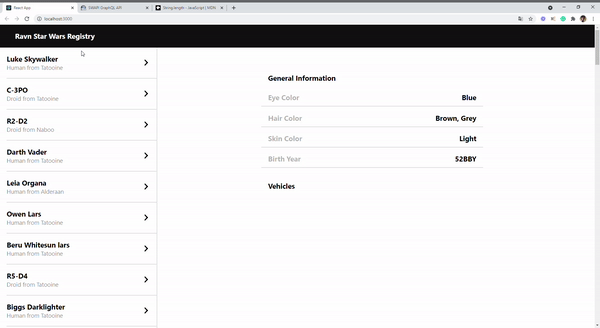
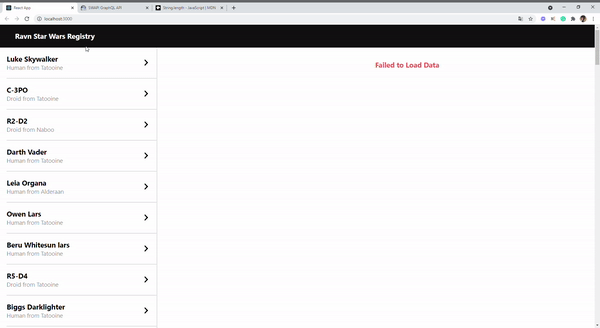
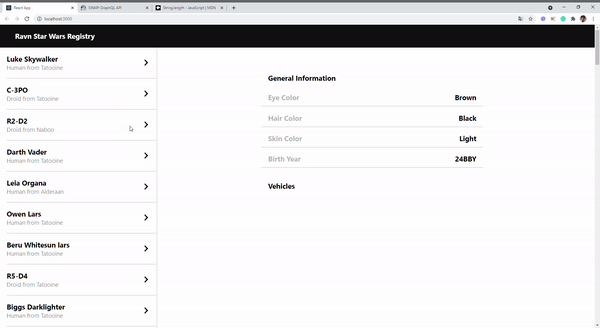

# RAVN Challenge by Guido Tpia

This is the solution proposed by Guido Tapia for the RAVN challenge.
The challenge consisted in the development of a web or mobile application for connection to a graphql database.
This proposal was carried out using the following technologies: 

- reactJS 
- Apollo-Client.

## Getting Started

1. Installing REACT
If this es your first time working with React, first you have to install node.js, you can download from the website https://nodejs.org/es/

If you already have it installed, the next step is update npm, you can do it with the command
#### `npm install -g npm@latest`
and to make sure we don't have any problems in the future, we clear the cache
### `npm cache clean --force`

and finally we install create-react-App
### `install -g create-react-app`

## Working Application.

1. The application shows a correct performance according to the requirements expressed in the functionality statement.

2. If we lose the conection an alert message will warn us that the data cannot be accessed.

3. Even though the design did not specify it, it was assumed that if the data of each character could not be displayed, a warning message should also be displayed.

